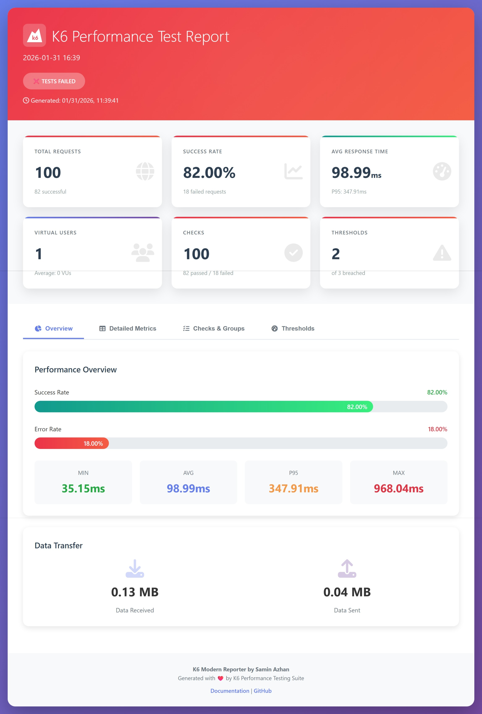

# k6-modern-reporter

A modern, beautiful HTML report generator for k6 performance tests with an interactive UI, responsive design, and comprehensive metrics visualization.

## Features

✨ **Modern UI Design**

- Gradient backgrounds and smooth animations
- Responsive layout that works on all devices
- Interactive tabbed interface
- Professional color scheme with intuitive visual indicators

📊 **Comprehensive Metrics**

- Performance overview with key statistics
- Detailed HTTP request metrics (duration, waiting, connecting, TLS, etc.)
- Data transfer statistics (sent/received)
- Request success/failure rates
- P90, P95, and percentile breakdowns

✅ **Test Validation**

- Visual check results with pass/fail counts
- Threshold status and validation results
- Overall test status indicator
- Detailed error tracking

🎯 **Customizable Reports**

- Custom titles and subtitles
- HTTP method display
- Additional test information sections
- Debug mode for troubleshooting

## Installation

### Direct Import Raw

Add the following import like this in any ts file:

```typescript
// @ts-ignore
import { htmlReport } from 'https://raw.githubusercontent.com/Samin005/k6-modern-reporter/refs/heads/main/k6-modern-reporter.js';
```

### Using NPM and esbuild

1. Run `npm i k6-modern-reporter` into your k6 project
2. Import `htmlReport` in your script:

    ```typescript
    import { htmlReport } from 'k6-modern-reporter';
    ```

3. k6 does not allow npm packages (since it uses go), so we have to create a bundle of the file if we want to run it. For example, let's say we have a `test.ts` (or `test.js`, works for both .ts and .js) with k6 tests:

    ```typescript
    import http from 'k6/http';
    import { htmlReport } from 'k6-modern-reporter';

    export const options = {
        scenarios: {
            shared_iteration: {
                executor: 'shared-iterations',
                vus: 50,
                iterations: 100,
                maxDuration: '60s',
            }
        }
    };

    export default function () {
        const response = http.get("https://httpbin.org/get");
    }

    // Generate the HTML report
    export function handleSummary(data) {
        const reportFileName = `./test-report-${new Date().toJSON().split(':').join('-')}.html`;
        return {
            [reportFileName]: htmlReport(data)
        };
    }
    ```

4. We have to create a bundle of the file `test.bundle.js` with esbuild.

    Windows Powershell:

    ```powershell
    npx esbuild test.ts --bundle --outfile=dist/test.bundle.js --format=esm --external:k6 --external:"k6/*"
    ```

    Mac/Linux:

    ```bash
    npx esbuild test.ts \
    --bundle \
    --outfile=dist/test.bundle.js \
    --format=esm \
    --external:k6 \
    --external:k6/*
    ```

5. Now run the bundle file with k6:

    ```bash
    k6 run dist/test.bundle.js
    ```

## Usage

### Basic Setup

Example of a k6 test script:

```typescript
import http from 'k6/http';
import { check } from 'k6';
// @ts-ignore
import { htmlReport } from 'https://raw.githubusercontent.com/Samin005/k6-modern-reporter/refs/heads/main/k6-modern-reporter.js';

export const options = {
    scenarios: {
        shared_iteration: {
            executor: 'shared-iterations',
            vus: 50,
            iterations: 100,
            maxDuration: '60s',
        }
    },
    thresholds: {
        'http_req_failed': ['rate==0.00'],
        'http_req_duration': ['p(95)<1000'],
        'checks': ['rate==1.00'],
    },
};

export default function () {
    const response = http.get("https://httpbin.org/get");
    
    check(response, {
        'Response status 200': (r) => r.status === 200,
    });
}

// Generate the HTML report
export function handleSummary(data) {
    const reportFileName = `./test-report-${new Date().toJSON().split(':').join('-')}.html`;
    return {
        [reportFileName]: htmlReport(data)
    };
}
```

## Report Layout

The generated HTML report includes the following sections, accessible via interactive tabs:

### 📈 Overview Tab (Default)



#### Performance Overview

- Total Requests counter
- Success Rate percentage
- Failed Requests count
- Overall Test Status (PASS/FAIL indicator)

#### Data Transfer

- Bytes received across all requests
- Bytes sent across all requests
- Avg request size
- Total data transferred

### 📊 Metrics Tab


Detailed HTTP request metrics table showing:

- **http_req_duration**: Total request time (Avg, Min, Median, Max, P90, P95)
- **http_req_waiting**: Server processing time
- **http_req_connecting**: TCP connection establishment time
- **http_req_tls_handshaking**: TLS/SSL handshake time
- **http_req_receiving**: Response download time
- **http_req_sending**: Request upload time

Color-coded values:

- 🟢 **Green**: Good performance metrics
- 🔴 **Red**: Poor performance metrics

### ✅ Checks Tab


Displays all test checks organized by groups with:

- Check name and description
- Pass count (green badge)
- Fail count (red badge)
- Pass/Fail rate percentage

### 🎯 Thresholds Tab


Shows threshold validation results:

- Threshold condition (e.g., `p(95)<1000`, `rate==0.00`)
- Actual value achieved
- Pass/Fail status with color coding

### 📝 Testing it out locally

Clone the repo and run:

```bash
npm test
```

## API Reference

### `htmlReport(data, options)`

Generates and returns a complete HTML document as a string.

**Parameters:**

- `data` (Object): The k6 test results data object containing metrics, checks, and thresholds
- `options` (Object): Configuration options
  - `title` (string): Main report title - defaults to current timestamp
  - `subtitle` (string): Subtitle or endpoint description
  - `httpMethod` (string): HTTP method used (GET, POST, PUT, DELETE, etc.)
  - `additionalInfo` (Object): Key-value pairs of custom test information
  - `debug` (boolean): If true, logs raw k6 data to console

**Returns:**

- (string): Complete HTML document

## License

MIT License. See LICENSE file for details.
